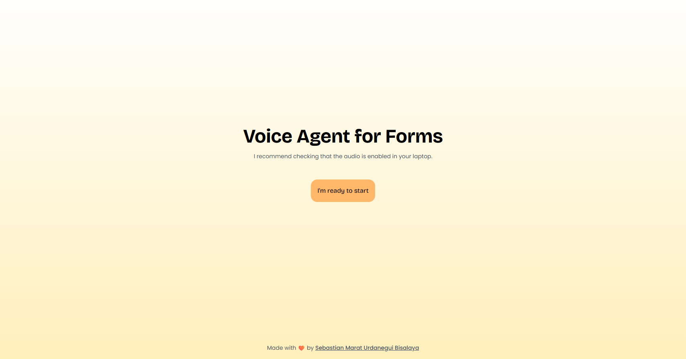

# Voice Agents Form - Client

> Made with 🧡 by [Sebastian Marat Urdanegui Bisalaya](https://sebastianurdanegui.com)

## Preview



## Installation

> [!WARNING]
> The client is not connected to the server yet, so you need to run the server first.

- Clone the repository

```
git clone https://github.com/SebastianUrdaneguiBisalaya/building-a-voice-agents-for-forms
```

- Move to the client folder

```bash
cd building-a-voice-agents-for-forms/client
```

- Install dependencies

```bash
pnpm install
```

- Run the project

```bash
pnpm dev
```
